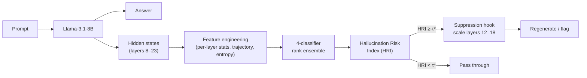

# Proactive Hallucination Detection & Mitigation in LLMs via Internal Activation Probing

> Detect — and **suppress** — hallucinations in Llama-3.1-8B from a single forward pass,
> using lightweight probes over internal activations. No fine-tuning, runs on a 4 GB GPU.

[](https://www.python.org/)
[](LICENSE)


M.Tech dissertation, CUSAT (Dept. of Computer Science), completed **April 2026**.
Author: **Girisankar G** · Guide: Dr. Santhosh Kumar G.

---

## TL;DR

LLMs hallucinate with the same fluent, confident tone as correct answers, so output text alone can't flag them. This project shows the **signal is already inside the model**: by probing hidden-state activations during generation, a tiny ensemble predicts whether a response is hallucinated — and, by suppressing the right layers, *reduces* the hallucination rate at inference time.

| Metric | Result |
|---|---|
| Ensemble AUC (held-out, N=300) | **0.737** (target 0.72) |
| Best single-layer probe | 0.712 (layer 16) |
| Hallucination signal localized to | **layers 12–18** of Llama-3.1-8B |
| Targeted suppression → hallucination reduction | **29.9%** (vs 6.5% uniform) |
| Training footprint | NVIDIA GTX 1650 Ti, **4 GB VRAM** |
| Added inference cost | `<1 ms`, `<1 MB` params |

## Why it matters

Existing hallucination detectors either need **gold references** at inference time (post-hoc fact-checking) or run the model **k×** to measure sampling consistency (SelfCheckGPT). Both are too slow/expensive for production. This pipeline is **single-pass and inference-only** — a practical inline quality filter.

## Approach



**Pipeline:** 1,500 factual QA pairs (TriviaQA + NQ-Open) → responses from Llama-3.1-8B (8-bit) → auto-labeled by a GPT-4o-mini judge (409 hallucinated / 1,091 correct) → activations extracted from 16 middle layers, projected 4096→256 → four complementary probes → rank-based ensemble → HRI → optional activation suppression.

**The four probes (intentionally diverse for ensemble gain):**
| Probe | Input | Params | Idea |
|---|---|---|---|
| Compact LR | 191 hand-designed features | — | linear baseline |
| RBF-SVM | 8,976 rich features → PCA(128) | — | non-linear on small data |
| **Attention MLP** | raw 16×64×256 tensor | ~34K | learns *per-layer attention* over the 16 layers |
| **TinyConvProbe** | raw 16×64×256 tensor | ~13K | treats layers as a temporal sequence (1D-conv); 0.05 ms CPU |

## Key findings

1. **Hallucination is layer-localized** — layers 12–18 carry the strongest signal, confirmed three independent ways (learned attention weights, per-layer probe AUC peaking at layer 16, and a causal suppression experiment).
2. **Multi-layer fusion beats any single layer** — ensemble 0.737 vs best single layer 0.712.
3. **Detection enables mitigation** — scaling *only* the top-6 attention-weighted layers cut hallucinations 4.6× more effectively than scaling all 16, evidence the localization is causal, not correlational.
4. **Honest ceiling analysis** — all four probes plateau at ~0.70–0.73; diagnosed as a ~13% **label-noise ceiling** (train/val AUC don't diverge → not overfitting), pointing to data quality, not architecture, as the next lever.

## Repository structure

```
hallucination-detection-probing/
├── README.md                     # you are here
├── ROADMAP.md                    # where this is going (real-time firewall + RAG routing)
├── report/                       # the full dissertation PDF + figures
├── src/
│   ├── data/                     # generate_responses.py, label_factuality.py
│   ├── features/                 # extract_activations.py, build_features.py
│   ├── models/                   # classifiers.py (4 probes), ensemble.py
│   ├── intervention/
│   │   ├── suppression_hook.py   # post-hoc activation suppression (from thesis)
│   │   └── realtime_firewall.py  # ★ WIP: online streaming HRI + RAG routing (see ROADMAP)
│   ├── train.py
│   └── evaluate.py
├── requirements.txt
└── LICENSE
```

> **Note:** drop your dissertation code into the `src/` layout above and the report PDF into `report/`. This README documents the intended structure.

## Quickstart

```bash
git clone https://github.com/im-girisankar/hallucination-detection-probing.git
cd hallucination-detection-probing
pip install -r requirements.txt

# 1. generate + label data   2. extract activations   3. train   4. evaluate
python -m src.data.generate_responses
python -m src.features.extract_activations
python -m src.train --data data/activations.npz
```

### Try it without a GPU (synthetic pipeline demo)
Steps 1–2 need a GPU and the gated Llama-3.1-8B. To exercise the **full probe + ensemble
pipeline** on synthetic activations (no GPU, no model, no API):

```bash
pip install torch numpy scikit-learn
python -m scripts.demo_synthetic        # plants a separable signal in layers 12-18, trains all 4 probes + ensemble
pytest                                  # 9 CPU smoke tests over features / probes / ensemble / suppression
```

This proves the code path end-to-end; it is **not** a measure of real detection performance
(that requires real Llama activations). The smoke tests run in CI on every push.

## Roadmap

This thesis is **phase 0**. The active direction is a **real-time hallucination firewall**: stream the HRI token-by-token during generation, suppress the implicated layers *as the model drifts*, and use a rising HRI as a trigger to **route the query to RAG** instead of trusting parametric memory. See **[ROADMAP.md](ROADMAP.md)**.

## Citation

```bibtex
@mastersthesis{girisankar2026hallucination,
  title  = {Proactive Hallucination Detection and Mitigation in Large
            Language Models via Internal Activation Probing},
  author = {Girisankar G},
  school = {Cochin University of Science and Technology (CUSAT)},
  year   = {2026}
}
```

## License

MIT — see [LICENSE](LICENSE).
