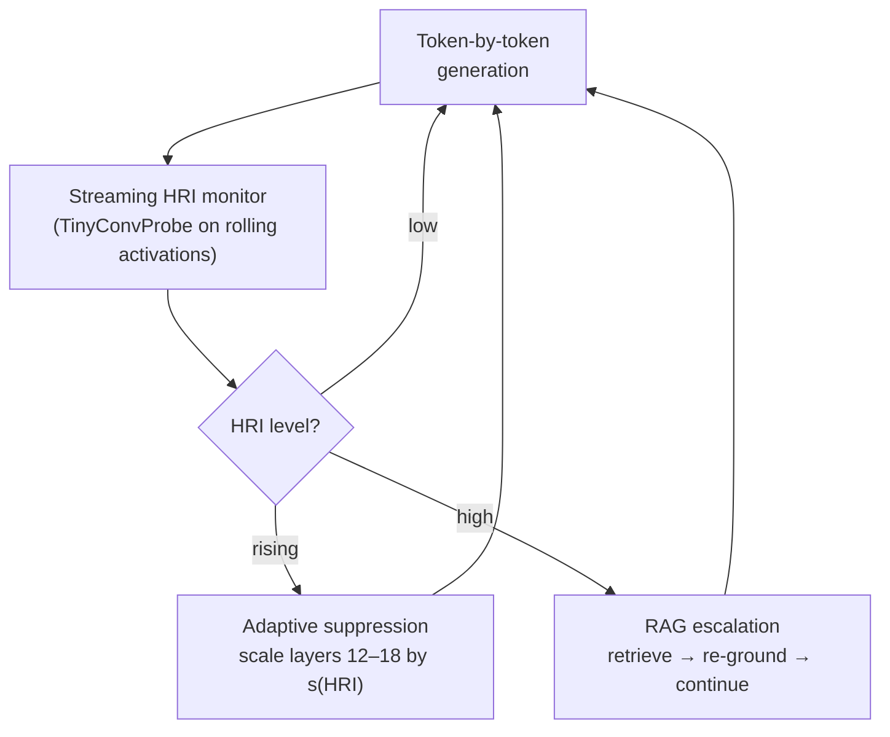

# Roadmap — From Offline Probe to Real-Time Hallucination Firewall

The dissertation (phase 0) proved three things that make a real-time system possible:
the hallucination signal **exists in the activations**, it is **localized to layers 12–18**,
and **suppressing those layers reduces hallucination causally** (29.9% vs 6.5% uniform).

Phase 0 did this *offline* and *post-hoc* (two-pass: probe, then regenerate). The goal
now is to make it **online** — a firewall that watches generation as it happens and
intervenes in the moment.

---

## The vision

> A streaming monitor reads the model's internal state while it generates. The moment the
> **Hallucination Risk Index (HRI)** starts to climb, the firewall (a) softly **suppresses
> the implicated layers (12–18)** to pull the model back toward factual grounding, and/or
> (b) **escalates to retrieval (RAG)** — treating a high HRI as the model itself signaling
> "I don't actually know this; go look it up."

HRI stops being a post-hoc label and becomes a **live control signal**.

---

## Phase 1 — Streaming token-level HRI
Turn the batch probe into an online monitor.
- [ ] Hook `output_hidden_states` into the autoregressive decode loop (per-step, not per-sequence).
- [ ] Maintain a rolling activation buffer over layers 8–23; compute HRI every *k* tokens.
- [ ] Use **TinyConvProbe** (0.05 ms CPU) as the streaming estimator to stay real-time.
- [ ] Calibrate a per-token HRI threshold (the thesis τ* = 0.57 is sequence-level; re-derive for streaming).
- **Deliverable:** a live HRI curve plotted against a generating response; spikes align with hallucinated spans.

## Phase 2 — Adaptive layer suppression (online intervention)
Make the thesis `SuppressionHook` dynamic instead of all-or-nothing.
- [ ] Replace fixed scale `s = 0.8` with a function `s(HRI)` — stronger suppression as risk rises.
- [ ] Suppress only the top-k attention-weighted layers (12–18), learned in phase 0.
- [ ] Guardrail: cap cumulative suppression to avoid the incoherence seen at `s ≤ 0.5` in the thesis.
- [ ] Ablate: fixed vs adaptive suppression on factual-QA hallucination rate + fluency (perplexity).
- **Deliverable:** measurable hallucination reduction *during* generation with bounded fluency cost.

## Phase 3 — HRI-driven RAG routing  ★ the headline idea
Use rising HRI as the trigger to stop trusting parametric memory and **retrieve**.
- [ ] When streaming HRI crosses a high threshold, pause generation and fire a retrieval call.
- [ ] Re-ground: inject retrieved context, restart/continue the span with the evidence in-context.
- [ ] Compare against always-RAG and never-RAG baselines — the bet is **selective** retrieval
      (retrieve only when the model signals uncertainty) matches always-RAG quality at a
      fraction of the retrieval cost/latency.
- [ ] Tie-in to the literature: this is an *internal-signal* router, complementary to ReDeEP
      (parametric vs external knowledge) — cite and benchmark against it.
- **Deliverable:** an "HRI-gated RAG" agent; metric = hallucination rate vs retrieval-calls-per-query.

## Phase 4 — Robustness & reach
- [ ] **Cross-model transfer** — do the layer-localization and probes transfer to Mistral-7B, Qwen, Llama-3-70B? Or must each model be re-probed?
- [ ] **Learnable intervention** — replace scalar suppression with a small learned linear "truthful-direction" steer (à la Inference-Time Intervention).
- [ ] **PCA over random projection** — thesis flagged +3–5% AUC headroom from retaining 80% variance vs the current ~6%.
- [ ] **Better labels** — re-label with GPT-4o + CoT + majority vote to lift the ~13% label-noise ceiling.

---

## How this connects to the rest of my work
- The streaming probe + eval harness graduate into **`llm-reliability-kit`** (a standalone pip-installable guardrails library) — see my portfolio.
- HRI-gated RAG is a concrete agentic system: pairs naturally with a **LangGraph** router where "HRI high" is an edge that routes to a retrieval node, with **Langfuse** tracing the decisions.

## Honest status
Phase 0 is **done and reproducible** (thesis + this repo). Phases 1–4 are **active design/dev** —
`src/intervention/realtime_firewall.py` is a working skeleton of the phase 1–3 architecture, not
yet a finished system. PRs/issues tracking each phase live in this repo.
